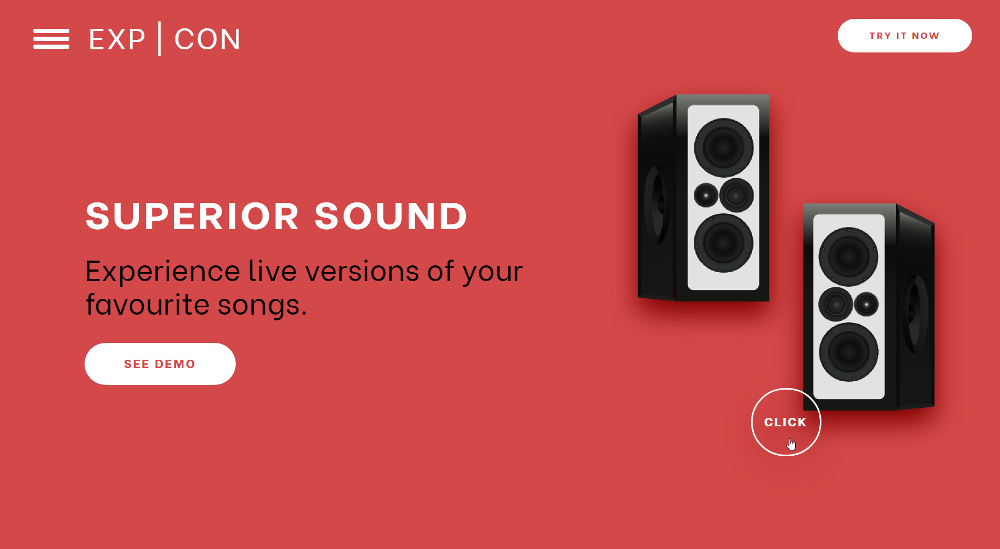
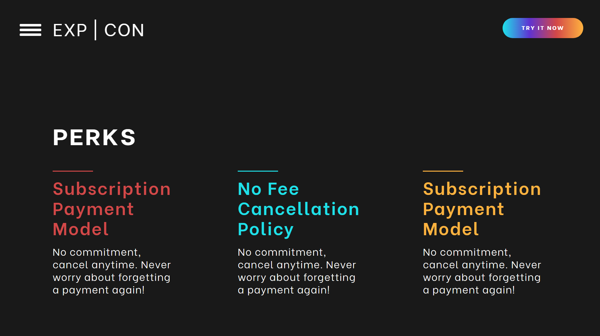
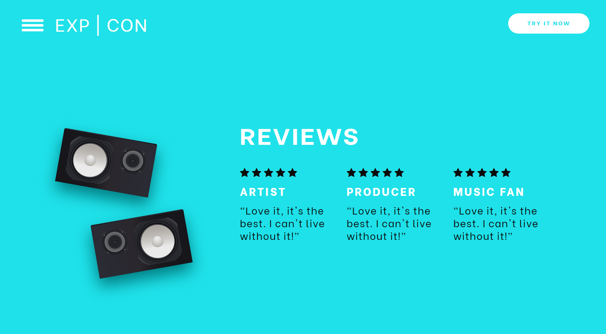
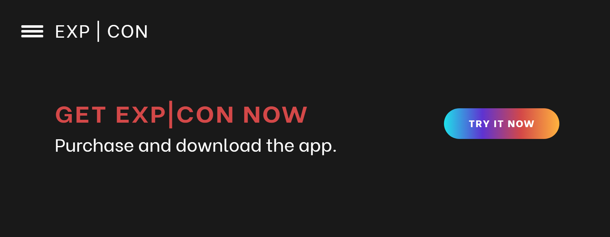
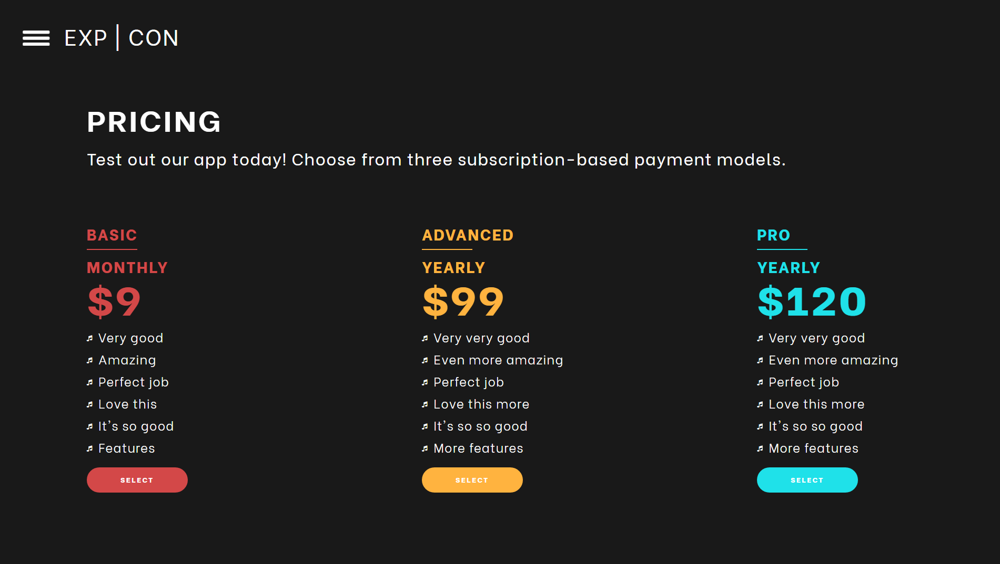
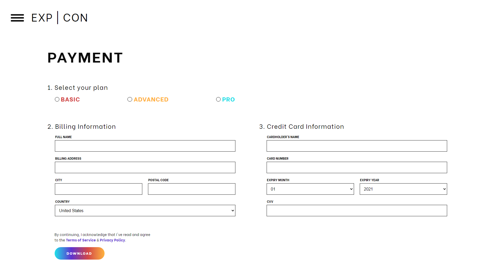

<!-- TITLE -->
<div align="center">

<p>
<h1>EXP | CON</h1>
<p>Demo project for Speer Technologies Inc.
</p>

<p>Built with <a href="https://reactjs.org/">ReactJS</a> and hosted with <a href="https://www.netlify.com/">Netlify</a></p>

<b><a href="https://ahhreggi-expcon.netlify.app/" target="_blank">
   » View Live Demo «
</a></b>

</div>

<!-- INSTALLATION -->

## 🛠 Installation

1. Clone or download this repository
   ```
   git clone https://github.com/ahhreggi/exp-con
   ```
2. Navigate to the project directory and install dependencies
   ```
   cd exp-con
   npm install
   ```
3. Launch the development web server
   ```
   npm start
   ```
4. Visit <a href="http://localhost:3000/">http://localhost:3000/</a> on your browser

## 📷 Screenshots









